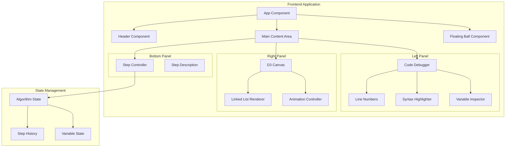

# Design Document

## Overview

本项目是一个单页面算法可视化教学网站，使用 TypeScript + React + D3.js 技术栈构建。网站专注于展示 LeetCode 138 题「随机链表的复制」算法的执行过程，提供分步骤演示、代码调试视图、变量值展示等功能。

项目将部署在 GitHub Pages 上，通过 GitHub Actions 实现自动化构建和部署。

## Architecture



## Components and Interfaces

### Core Components

#### 1. App Component
根组件，负责整体布局和状态管理。

```typescript
interface AppProps {}

interface AppState {
  currentStep: number;
  isPlaying: boolean;
  playbackSpeed: number;
}
```

#### 2. Header Component
页面头部，包含标题和 GitHub 链接。

```typescript
interface HeaderProps {
  title: string;
  leetcodeUrl: string;
  githubUrl: string;
}
```

#### 3. CodeDebugger Component
代码调试展示组件，显示带语法高亮的 Java 代码。

```typescript
interface CodeDebuggerProps {
  code: string;
  currentLine: number;
  variables: VariableState[];
  language: 'java';
}

interface VariableState {
  name: string;
  value: string;
  line: number;
  type: 'primitive' | 'reference' | 'null';
}
```

#### 4. LinkedListCanvas Component
D3.js 链表可视化画布。

```typescript
interface LinkedListCanvasProps {
  originalList: LinkedListNode[];
  copiedList: LinkedListNode[];
  currentNodeIndex: number;
  highlightedPointers: PointerHighlight[];
  stepDescription: string;
}

interface LinkedListNode {
  id: string;
  value: number;
  nextId: string | null;
  randomId: string | null;
  x: number;
  y: number;
  isCopy: boolean;
}

interface PointerHighlight {
  fromId: string;
  toId: string;
  type: 'next' | 'random';
  isAnimating: boolean;
}
```

#### 5. StepController Component
步骤控制器，管理算法演示的导航。

```typescript
interface StepControllerProps {
  currentStep: number;
  totalSteps: number;
  isPlaying: boolean;
  onPrevious: () => void;
  onNext: () => void;
  onPlayPause: () => void;
  onSpeedChange: (speed: number) => void;
}
```

#### 6. FloatingBall Component
悬浮球组件，展示微信交流群二维码。

```typescript
interface FloatingBallProps {
  qrCodeImage: string;
  tooltipText: string;
}
```

### Algorithm State Management

```typescript
interface AlgorithmStep {
  stepNumber: number;
  description: string;
  codeLine: number;
  variables: VariableState[];
  originalList: LinkedListNode[];
  copiedList: LinkedListNode[];
  highlightedNodeId: string | null;
  highlightedPointers: PointerHighlight[];
}

interface AlgorithmState {
  steps: AlgorithmStep[];
  currentStepIndex: number;
  isPlaying: boolean;
  playbackSpeed: number;
}
```

### Keyboard Shortcuts

```typescript
interface KeyboardShortcut {
  key: string;
  action: 'previous' | 'next' | 'playPause';
  description: string;
}

const KEYBOARD_SHORTCUTS: KeyboardShortcut[] = [
  { key: 'ArrowLeft', action: 'previous', description: '←' },
  { key: 'ArrowRight', action: 'next', description: '→' },
  { key: ' ', action: 'playPause', description: 'Space' },
];
```

## Data Models

### Linked List Node Model

```typescript
interface ListNode {
  val: number;
  next: ListNode | null;
  random: ListNode | null;
}
```

### Visualization Node Model

```typescript
interface VisualNode {
  id: string;
  val: number;
  index: number;
  nextIndex: number | null;
  randomIndex: number | null;
  position: { x: number; y: number };
  isOriginal: boolean;
  isHighlighted: boolean;
  isProcessed: boolean;
}
```

### Step Model

```typescript
interface Step {
  id: number;
  phase: 'init' | 'interleave' | 'copyRandom' | 'separate';
  description: string;
  codeLineStart: number;
  codeLineEnd: number;
  variables: Map<string, string>;
  visualState: {
    originalNodes: VisualNode[];
    copiedNodes: VisualNode[];
    activePointers: Array<{
      from: string;
      to: string;
      type: 'next' | 'random';
    }>;
  };
}
```


## Correctness Properties

*A property is a characteristic or behavior that should hold true across all valid executions of a system-essentially, a formal statement about what the system should do. Properties serve as the bridge between human-readable specifications and machine-verifiable correctness guarantees.*

Based on the prework analysis, the following properties can be combined and refined:

### Property Reflection

- Properties 2.1 and 2.2 (step navigation) can be combined into a single bidirectional navigation property
- Properties 3.2, 3.3, and 6.1 (synchronization) can be combined into a single state synchronization property
- Properties 4.1 and 4.6 (node rendering) can be combined into a single node visualization property
- Properties 6.2 and 6.3 (step information) can be combined into a single step information completeness property

### Correctness Properties

**Property 1: Step Navigation Consistency**
*For any* algorithm state with currentStep in range [0, totalSteps-1], navigating forward then backward (or backward then forward) should return to the original step, and the step value should always remain within valid bounds [0, totalSteps-1].
**Validates: Requirements 2.1, 2.2**

**Property 2: Play/Pause Toggle Idempotence**
*For any* playing state (true or false), toggling the play/pause state twice should return to the original state.
**Validates: Requirements 2.3**

**Property 3: Code-Canvas State Synchronization**
*For any* algorithm step, the highlighted code line, displayed variables, and canvas visualization should all correspond to the same step index, ensuring the three views are always synchronized.
**Validates: Requirements 3.2, 3.3, 6.1**

**Property 4: Variable Display Completeness**
*For any* step that defines variables, all variables should be displayed at their corresponding code lines, and pointer variables should include reference notation (e.g., "→ node@index").
**Validates: Requirements 3.3, 3.5**

**Property 5: Node Visualization Completeness**
*For any* set of linked list nodes, all nodes should be rendered on the canvas with their values visible, and the currently processed node should have distinct highlighting.
**Validates: Requirements 4.1, 4.6**

**Property 6: Step Information Completeness**
*For any* algorithm step, the step should have a non-empty description, and for steps that process nodes, the correspondence between original and copied nodes should be indicated.
**Validates: Requirements 6.2, 6.3**

## Error Handling

### User Input Errors
- Invalid keyboard input: Ignore keys that are not mapped to actions
- Rapid key presses: Debounce navigation actions to prevent state corruption

### State Errors
- Out-of-bounds step navigation: Clamp step index to valid range [0, totalSteps-1]
- Invalid playback speed: Default to 1x speed if invalid value provided

### Rendering Errors
- Missing node data: Display placeholder with error indicator
- D3 rendering failure: Show fallback static visualization
- Image loading failure: Display placeholder icon for QR code

### Network Errors
- Failed to load external resources: Use bundled fallback assets

## Testing Strategy

### Unit Testing

Use Vitest for unit testing React components and utility functions.

**Test Coverage Areas:**
- Component rendering with various props
- Keyboard event handling
- Step navigation logic
- Variable formatting utilities

### Property-Based Testing

Use fast-check library for property-based testing in TypeScript.

**Configuration:**
- Minimum 100 iterations per property test
- Custom generators for algorithm steps and linked list structures

**Property Tests to Implement:**
1. Step navigation bounds checking
2. Play/pause toggle consistency
3. State synchronization verification
4. Variable display completeness
5. Node rendering completeness
6. Step information completeness

Each property-based test must be tagged with:
`**Feature: random-linked-list-copy-visualizer, Property {number}: {property_text}**`

### Integration Testing

- Verify keyboard shortcuts trigger correct actions
- Verify step changes update all synchronized components
- Verify D3 canvas renders correctly with algorithm state

### Visual Testing

- Manual verification of layout on standard desktop resolutions
- Verify QR code image aspect ratio preservation
- Verify syntax highlighting appearance
